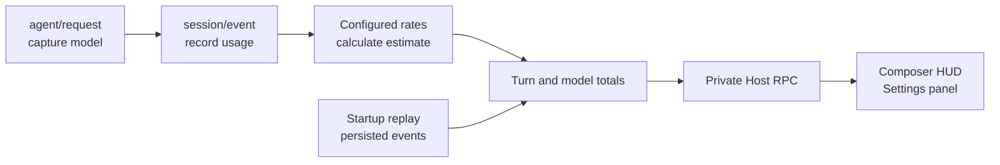

<div align="center">
  
</div>

<div align="center">
  <a href="README.md">English</a> · <a href="README.zh-CN.md">简体中文</a>
</div>

<div align="center">

[](CHANGELOG.md)
[](https://github.com/chenzhiyong1994/dsh-cost-guard/actions/workflows/check.yml)
[](LICENSE)
[](https://github.com/topics/dsh-plugin)

</div>

# dsh-cost-guard

Know what every DSH task costs while it runs. `dsh-cost-guard` is a local-only dynamic Cordis plugin for [DeepSeek Harness](https://github.com/deepseek-ai/deepseek-harness) that turns recorded token usage into a compact live cost HUD, per-model totals, and editable pricing.

It observes execution; it never blocks, reroutes, or changes the agent.

> [!IMPORTANT]
> Token counts come from DSH usage events. Currency amounts are local estimates calculated from your configured rates, not authoritative billing data. Provider prices can change—always treat the provider invoice as the source of truth.

## See it in action

### One quiet HUD, all the useful numbers

The composer dock shows the current or most recent task, model, input/output/cache tokens, model-call count, task estimate, and session total without opening another panel.


### Pricing and totals stay under your control

Edit model rates, add custom models, apply the official peak/off-peak schedule, inspect per-model totals, and export or import the configuration from **Settings → Cost Guard**.


> The screenshots were captured from an earlier configured instance. Release `v4.3.0` ships with the official DeepSeek V4 peak/off-peak schedule enabled by default and uses the current rates described below.

## Why Cost Guard

- **Actual usage, not prompt-size guessing** — reads `inputTokens`, `outputTokens`, `cacheReadTokens`, and `cacheWriteTokens` from DSH session events.
- **Live and glanceable** — keeps task cost and token mix beside the composer where decisions happen.
- **Subagent-aware** — rolls subagent usage into the active root-session turn.
- **Restart-resilient** — replays persisted session events to rebuild historical totals when the plugin starts.
- **Pricing you can audit** — all model rates and the peak/off-peak windows are visible and editable.
- **Bilingual UI** — the HUD and settings page follow the DSH language setting (中文 / English) automatically.
- **Local-only** — no telemetry, external service, account access, or API key collection.
- **Zero execution interference** — no prediction gate, approval overlay, or model routing.

## Quick start

### Ask your DSH agent to install it

Paste this into a DSH conversation:

```text
Install the dynamic Cordis plugin dsh-cost-guard from
https://github.com/chenzhiyong1994/dsh-cost-guard

Read docs/install.md in that repository and follow the online installation.
Before running it, use cordis_inspect_self and confirm both hasHostHalf and
hasClientHalf are true. Then activate it and report the installed plugin ID.
```

The agent fetches [`host.js`](host.js) and [`client.js`](client.js), defines both halves, verifies the package, and activates it. No build step is required.

For the full online/offline prompt and update procedure, see [Installation](docs/install.md).

### Requirements

- DeepSeek Harness with the dynamic Cordis tools available.
- DSH Web UI for the HUD and settings panel.
- Tested against DSH `0.1.0-rc.6`; internal APIs may change between DSH releases.

## Pricing model

The `v4.3.0` defaults match the official DeepSeek V4 peak/off-peak pricing that took effect on 2026-08-17 (verified against the [DeepSeek API pricing page](https://api-docs.deepseek.com/zh-cn/quick_start/pricing/) and the [official announcement](https://news.qq.com/rain/a/20260817V03S1500)). Rates are CNY per 1M tokens, off-peak (valley) prices:

| Model | Input · cache miss | Output | Input · cache hit |
| --- | ---: | ---: | ---: |
| `deepseek-v4-flash` | ¥1.5 | ¥4.5 | ¥0.05 |
| `deepseek-v4-pro` | ¥4.5 | ¥13.5 | ¥0.15 |
| `default` fallback | ¥1.5 | ¥4.5 | ¥0.05 |

Peak hours are 9:00–12:00 and 14:00–18:00 Beijing time, billed at ×2 the off-peak price. Peak/off-peak pricing is **on by default**; toggle it and edit the windows from the settings page.

Cache-write tokens use the cache-miss input rate because the official table has no separate cache-write item. Legacy names are mapped for convenience: `deepseek-chat` → Flash and `deepseek-reasoner` → Pro.

## How it works



- **Host half** listens to `agent/request` and `session/event`, attributes usage to turns, rolls up subagents, and exposes private RPC handlers.
- **Client half** registers the HUD in `conversation.composer.dock` and the configuration UI in `settings.section`.
- **Data flow** stays inside the running DSH process. The plugin does not call a network endpoint.

## Configuration

Open **Settings → Cost Guard** to manage:

| Section | Controls |
| --- | --- |
| Model pricing | Cache-miss input, output, and cache-hit input rates; custom models; restore defaults |
| Peak/off-peak pricing | Official windows (9:00–12:00, 14:00–18:00 Beijing) at ×2; enabled by default |
| Session totals | Settled tasks, estimated spend, exchange rate, and per-model totals |
| Backup | Export or import the configuration as JSON |

The USD amount in the HUD is an approximate conversion using the editable CNY/USD rate. All UI text follows the DSH language setting (中文 / English).

## Updating

Dynamic packages are replaced as a whole. Always submit both files when updating:

1. Fetch the latest `host.js` and `client.js`.
2. Run `cordis_define` with `kind: "existing"` and the installed plugin ID, providing both `code.host` and `code.client`.
3. Run `cordis_inspect_self`; continue only when both halves are present.
4. Run `cordis_run` in update mode.

## Security and privacy

- No outbound requests, telemetry, credential reads, or API key storage.
- The Host observes DSH session usage events and replays persisted session events to reconstruct totals.
- Imported configuration is validated before it replaces the active settings.
- Review third-party plugin source before installing it, especially because DSH plugin interfaces are still evolving.

See [SECURITY.md](SECURITY.md) for reporting guidance.

## Project layout

| Path | Purpose |
| --- | --- |
| [`host.js`](host.js) | Dynamic Cordis Host half |
| [`client.js`](client.js) | Dynamic Cordis Web client half |
| [`docs/install.md`](docs/install.md) | Copy-paste online and offline installation prompts |
| [`scripts/check.js`](scripts/check.js) | Syntax and release-invariant checks |
| [`CHANGELOG.md`](CHANGELOG.md) | Release history |

## Development

```sh
npm run check
```

`host.js` and `client.js` are function-body fragments consumed by `cordis_define`, so the check compiles them with the JavaScript `Function` constructor instead of executing them as standalone Node.js programs.

Contributions are welcome—please read [CONTRIBUTING.md](CONTRIBUTING.md). If the plugin saves you from token-bill surprises, consider starring the repository so other DSH users can find it.

## Compatibility

This plugin depends on internal DSH services and UI slots (`sessions`, `session/event`, `agent/request`, `conversation.composer.dock`, `settings.section`, and private Host RPC). They are not guaranteed stable APIs. Include your DSH version when reporting compatibility problems.

## License

[MIT](LICENSE)
