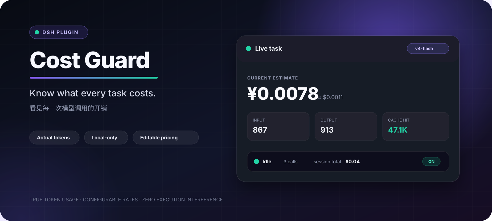
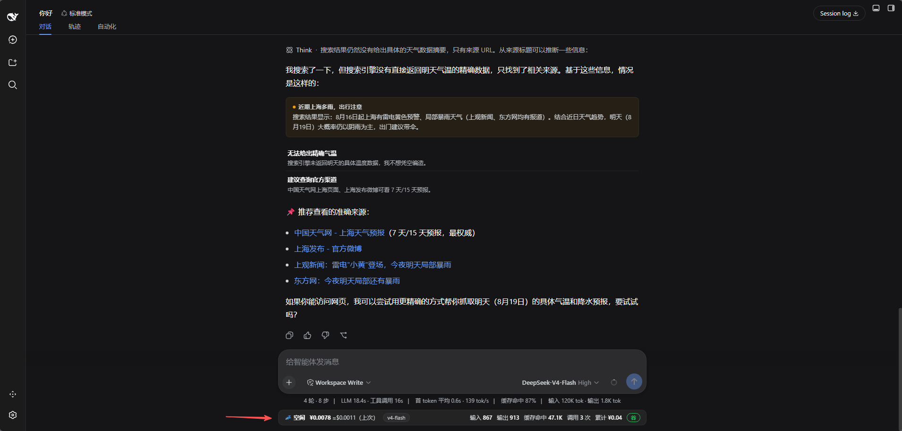
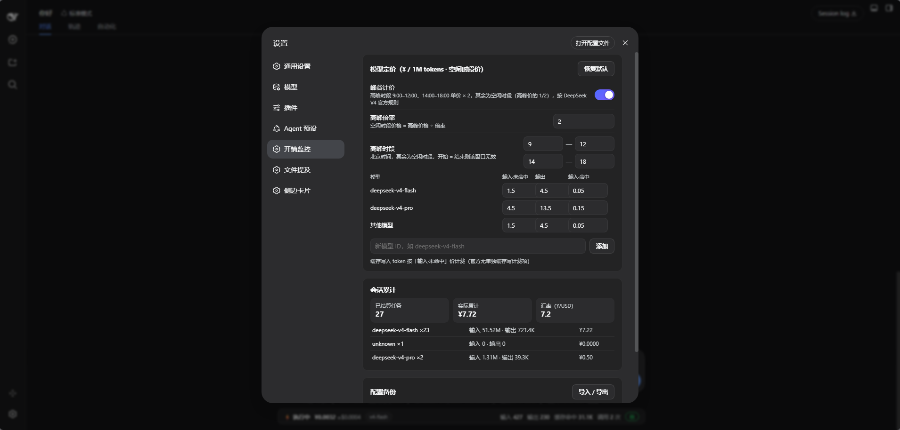
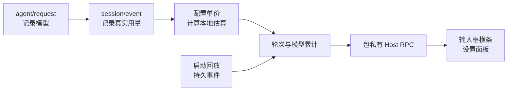

<div align="center">
  
</div>

<div align="center">
  <a href="README.md">English</a> · <a href="README.zh-CN.md">简体中文</a>
</div>

<div align="center">

[](CHANGELOG.md)
[](https://github.com/chenzhiyong1994/dsh-cost-guard/actions/workflows/check.yml)
[](LICENSE)
[](https://github.com/topics/dsh-plugin)

</div>

# dsh-cost-guard

在任务执行过程中看清每一分钱花在哪里。`dsh-cost-guard` 是为 [DeepSeek Harness](https://github.com/deepseek-ai/deepseek-harness) 编写的本地动态 Cordis 插件：它把 DSH 记录的真实 token 用量转换成简洁的实时开销横条、按模型累计统计和可编辑价格表。

插件只旁路观察，不会拦截、改写或路由 Agent 的执行。

> [!IMPORTANT]
> Token 数来自 DSH 的 usage 事件；金额由本地配置单价计算，是费用估算，不是权威账单。供应商可能随时调价，请始终以供应商实际账单为准。

## 实际效果

### 一个安静但信息完整的横条

输入框旁直接显示当前或上一次任务、模型、输入 / 输出 / 缓存 token、模型调用次数、本次估算金额和会话累计，不需要打开额外面板。



### 价格和累计始终由你掌控

在 **设置 → 开销监控** 中编辑模型单价、添加自定义模型、按需启用时段倍率、查看按模型累计，并导入或导出配置。



> 截图来自启用了可选时段倍率的早期配置实例。`v4.2.0` 发布版默认关闭该选项，并使用下文所列的当前基础价。

## 为什么值得安装

- **基于真实用量，不猜提示词大小**：读取 DSH usage 中的输入、输出、缓存命中和缓存写入 token。
- **实时且一眼可见**：把任务费用与 token 构成放在输入框旁边。
- **支持子代理汇总**：子代理用量回卷到根会话的当前轮次。
- **重启可恢复**：启动时回放持久会话事件，重建历史累计。
- **价格可审计**：所有模型单价和可选时段倍率都能在设置页查看和修改。
- **完全本地**：无遥测、无外部服务、无账号访问，不收集 API Key。
- **零执行干预**：没有预测门禁、确认遮罩或模型路由。

## 快速开始

### 让 DSH 智能体替你安装

把下面这段发给 DSH：

```text
请从 https://github.com/chenzhiyong1994/dsh-cost-guard
安装动态 Cordis 插件 dsh-cost-guard。

读取仓库中的 docs/install.md 并按“在线安装”执行。运行前必须使用
cordis_inspect_self 确认 hasHostHalf 与 hasClientHalf 都为 true，
然后激活插件并告诉我安装后的插件 ID。
```

智能体会获取 [`host.js`](host.js) 和 [`client.js`](client.js)，定义并检查两个半部分后激活插件，无需构建。

完整的在线 / 离线提示词和更新方法见[安装指南](docs/install.md)。

### 运行要求

- 可使用动态 Cordis 工具的 DeepSeek Harness。
- HUD 和设置页需要 DSH Web UI。
- 已在 DSH `0.1.0-rc.6` 验证；DSH 内部接口可能随版本变化。

## 计价模型

`v4.2.0` 默认值已于 2026-08-18 对照 [DeepSeek API 官方定价页](https://api-docs.deepseek.com/zh-cn/quick_start/pricing/)；单位为人民币元 / 1M tokens：

| 模型 | 输入·缓存未命中 | 输出 | 输入·缓存命中 |
| --- | ---: | ---: | ---: |
| `deepseek-v4-flash` | ¥1 | ¥2 | ¥0.02 |
| `deepseek-v4-pro` | ¥3 | ¥6 | ¥0.025 |
| `default` 兜底 | ¥1 | ¥2 | ¥0.02 |

官方表格没有单列缓存写入价，因此缓存写入 token 按输入缓存未命中价计算。为兼容旧名称，`deepseek-chat` 映射到 Flash，`deepseek-reasoner` 映射到 Pro。

可选时段倍率**默认关闭**。只有你的供应商或账号确实采用分时价格时才应启用，并按实际账单填写时间窗与倍率。

## 工作原理



- **Host 半部分**监听 `agent/request` 与 `session/event`，归属轮次、汇总子代理，并提供包私有 RPC。
- **Client 半部分**在 `conversation.composer.dock` 注册横条，在 `settings.section` 注册设置页。
- **数据流**只留在当前 DSH 进程内，插件不会请求网络端点。

## 配置项

打开 **设置 → 开销监控**：

| 区块 | 可配置内容 |
| --- | --- |
| 模型定价 | 输入未命中、输出、输入命中单价；自定义模型；恢复默认 |
| 时段倍率 | 可选的北京时间窗口和倍率；默认关闭 |
| 会话累计 | 已结算任务、估算金额、汇率、按模型统计 |
| 配置备份 | JSON 导出与导入 |

横条中的美元金额使用可编辑的人民币 / 美元汇率近似换算。

## 更新

动态包采用整体替换，更新时必须同时提交两个文件：

1. 获取最新版 `host.js` 与 `client.js`；
2. 使用已安装插件 ID 调用 `cordis_define`，`kind: "existing"`，同时提供 `code.host` 与 `code.client`；
3. 调用 `cordis_inspect_self`，仅在两个半部分都存在时继续；
4. 使用 update 模式调用 `cordis_run`。

## 安全与隐私

- 不发起外部请求，不含遥测，不读取凭据，不存储 API Key。
- Host 观察 DSH 会话 usage，并回放持久会话事件以重建累计。
- 导入配置通过校验后才会替换当前设置。
- DSH 插件接口仍在快速演进，请在安装第三方插件前审查源码。

安全问题反馈方式见 [SECURITY.md](SECURITY.md)。

## 项目结构

| 路径 | 用途 |
| --- | --- |
| [`host.js`](host.js) | 动态 Cordis Host 半部分 |
| [`client.js`](client.js) | 动态 Cordis Web Client 半部分 |
| [`docs/install.md`](docs/install.md) | 可复制的在线 / 离线安装提示词 |
| [`scripts/check.js`](scripts/check.js) | 语法与发布不变量检查 |
| [`CHANGELOG.md`](CHANGELOG.md) | 版本记录 |

## 开发

```sh
npm run check
```

`host.js` 和 `client.js` 是交给 `cordis_define` 的函数体片段，不是独立 Node.js 程序；检查脚本会用 JavaScript `Function` 构造器编译它们。

欢迎阅读 [CONTRIBUTING.md](CONTRIBUTING.md) 后参与贡献。如果它帮你看清了 token 账单，也欢迎点 Star，让更多 DSH 用户找到它。

## 兼容性

插件依赖 DSH 内部服务与 UI Slot（`sessions`、`session/event`、`agent/request`、`conversation.composer.dock`、`settings.section` 和包私有 Host RPC），这些并非稳定公开 API。反馈兼容问题时请附上 DSH 版本。

## License

[MIT](LICENSE)
